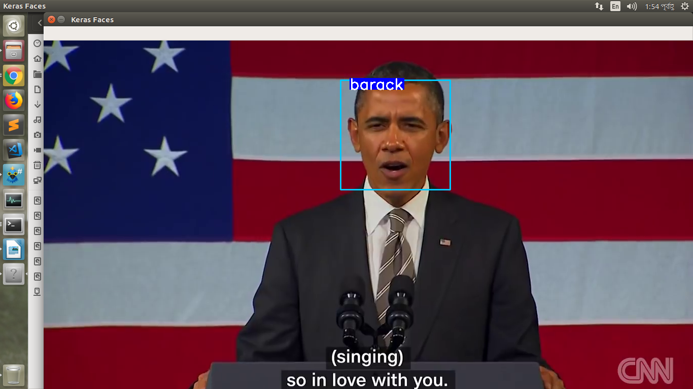
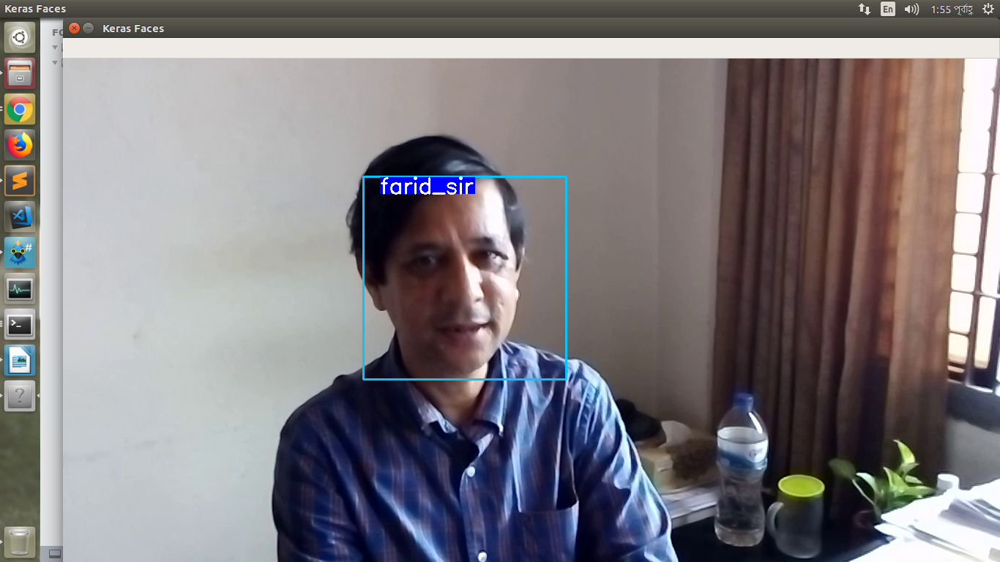

# Face Identification

This is project was created by vgg16 pretrained model.

 Here is the demo



And



## Environment
- python == 3.6
- numpy==1.13.3+mkl
- Keras==2.2.4
- tensorflow = 1.13.1  
- opencv-python==4.1.1+contrib
- keras_vggface = 0.6  
- scipy = 1.2.1
### Folder structure
######This repo file and folder structure,

                ├── data
                │   ├── precompute_features.pickle
                │   └── videos
                │       ├── barack
                │       │   ├── barack1.avi
                │       │   └── barack2.avi
                │       ├── farid_sir
                │       │   ├── VID_20190924_144246.3gp
                │       │   └── VID_20190924_144527.3gp
                │       └── michelle
                │           ├── michelle1.avi
                │           └── michelle2.avi
                ├── face_identify_demo.py
                ├── precompute_features.py
                ├── pretrained_models
                │   └── haarcascade_frontalface_alt.xml
                ├── README.md
                ├── requirements.txt
                └── result
                    ├── barak.png
                    └── farid.png


### install requirements
```
pip3 install -r requirements.txt
```

## Run the demo
First run this to generate images from video files and precompute face features
```
python face_identify_demo.py
```
Then run the real time demo,
```
python face_identify_demo.py
```
##Train the model 

Run,
```
python precompute_features.py

```
###Contributor

- Md.saiful islam
- Shahmuna Tonni


we try to follow this [blog](https://www.dlology.com/blog/live-face-identification-with-pre-trained-vggface2-model/).
